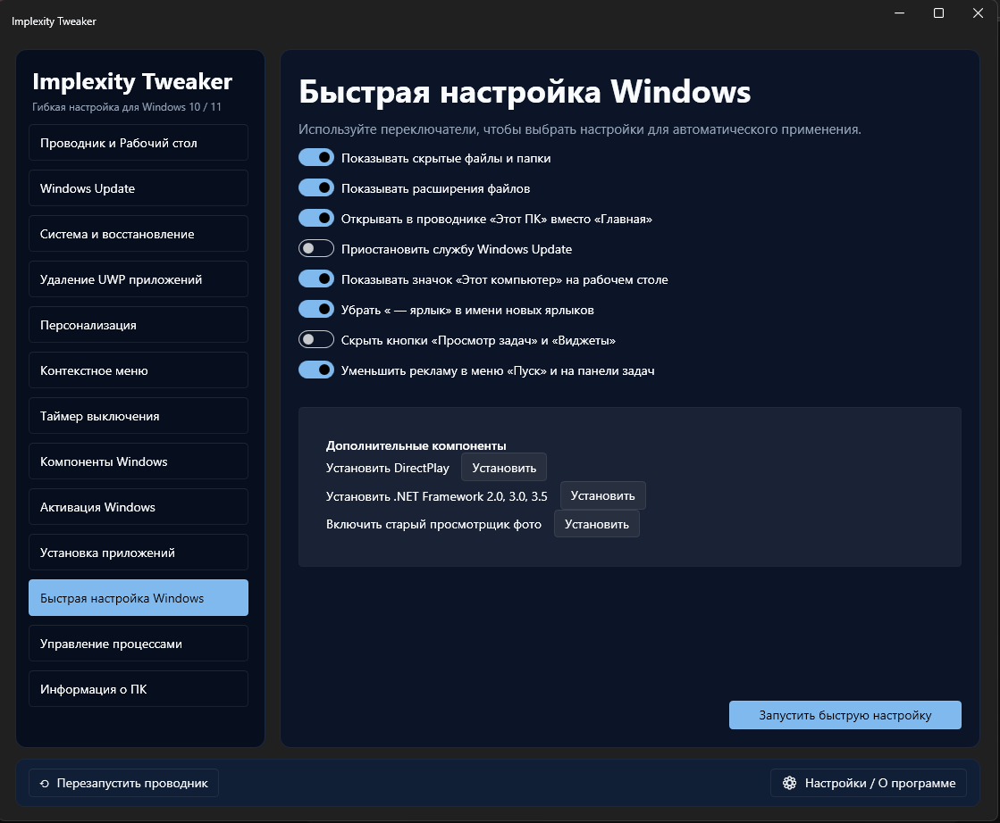

# ⚡ Implexity Tweaker

  
  
  

**Implexity Tweaker** — это современный и интуитивно понятный инструмент для гибкой настройки и оптимизации операционных систем Windows 10 и 11. Утилита объединяет в себе десятки популярных твиков, позволяя управлять системой через чистый и удобный графический интерфейс.

---
## 📸 Интерфейс программы

  

## ✨ Ключевые модули и возможности

Инструмент разбит на логические категории, доступные в боковом меню:

* **🗔 Быстрая настройка Windows (Текущий вид):** Мгновенное применение самых востребованных настроек:
    * Управление отображением скрытых файлов, папок и расширений.
    * Настройка поведения Проводника («Этот ПК» вместо «Главная»).
    * Управление службой Windows Update.
    * Очистка рабочего стола (значок «Этот ПК», удаление «— ярлык»).
    * Откулючение рекламы в меню «Пуск» и на панели задач.
* **🛠️ Дополнительные компоненты:** Быстрая установка важных библиотек:
    * DirectPlay (для старых игр).
    * .NET Framework 2.0, 3.0, 3.5.
    * Включение классического Просмотрщика фотографий Windows.
* **📂 Проводник и Рабочий стол:** Глубокая настройка интерфейса.
* **🔄 Windows Update:** Управление обновлениями.
* **⚙️ Система и восстановление:** Системные параметры и бэкапы.
* **🗑️ Удаление UWP приложений:** Очистка от предустановленного софта.
* **🎨 Персонализация:** Визуальная настройка системы.
* **📋 Контекстное меню:** Редактирование меню правой кнопки мыши.
* **⏱️ Таймер выключения:** Удобное управление питанием.
* **🔐 Активация Windows:** Легальная активация системы через KMS.
* **🚀 Управление процессами:** Оптимизация запущенных программ.
* **ℹ️ Информация о ПК:** Сводка технических характеристик.

---
## 📦 Особенности сборки (Self-Contained)

Размер файла составляет **222 МБ**, и вот почему это круто:

1. **Zero Dependencies:** Вам **не нужно** скачивать или устанавливать .NET Runtime. Все необходимые библиотеки уже вшиты в один `.exe`.
2. **Portable:** Программа работает сразу после скачивания. Никаких установщиков.
3. **Modern UI:** Вес обусловлен использованием библиотеки **WPF-UI**, которая обеспечивает нативный Fluent Design в стиле Windows 11.

---

## 🚀 Как использовать

> **⚠️ ВАЖНО:** Все изменения реестра и системных файлов вы делаете на свой страх и риск. Настоятельно рекомендуется создать **точку восстановления системы** перед запуском.

1.  **Скачайте** последнюю версию из раздела [Releases](https://github.com/0kar1d3/ImplexityTweaker/releases).
2.  Запустите исполняемый файл **от имени администратора**.
3.  Перейдите в нужный раздел (например, **«Быстрая настройка Windows»**).
4.  Используйте переключатели для выбора настроек.
5.  Нажмите кнопку **«Запустить быструю настройку»** (или аналогичную кнопку в другом разделе).
6.  Для применения некоторых изменений может потребоваться кнопка **«Перезапустить проводник»** (в левом нижнем углу) или перезагрузка ПК.

---

---
## 🛠 Технологии
* **C# / .NET**.
* **[WPF-UI](https://github.com/lepoco/wpfui)**.

## 🛠 Технические требования

* **ОС:** Windows 10 / Windows 11 (x64) (может понадобится .NET 8.0 - https://dotnet.microsoft.com/download/dotnet/8.0/runtime)
* **Права:** Требуются права администратора.

---

## 📜 Дисклеймер

Автор не несет ответственности за возможные сбои в работе системы. Пожалуйста, используйте инструмент с умом.

---

Поддержите автора - поставьте <b>Star ⭐</b> на GitHub!

