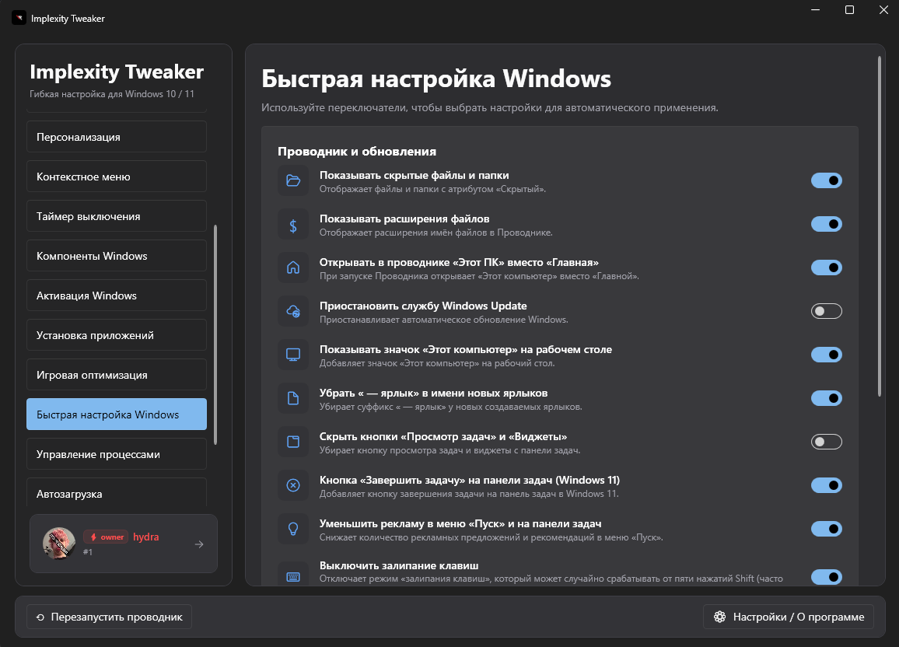

# ⚡ Implexity Tweaker

  
  
  

[**Русский**](#русский) | [**English**](#english)

---

## Русский

**Implexity Tweaker** — это современный, мощный и интуитивно понятный инструмент для гибкой настройки, оптимизации и персонализации операционных систем Windows 10 и 11. Утилита объединяет в себе десятки полезных твиков, управляет автозагрузкой, установкой софта, процессами и игровым режимом через чистый интерфейс в стиле Fluent Design.

🌐 **Официальный сайт:** [implexity.fun](https://implexity.fun)

---
### 📸 Интерфейс программы

  

### ✨ Ключевые модули и возможности

Инструмент разбит на удобные категории, доступные в боковом меню:

* **⚡ Быстрая настройка Windows:** Мгновенное применение самых востребованных параметров:
    * Отображение скрытых файлов, папок и расширений.
    * Поведение Проводника («Этот ПК» вместо «Главная»).
    * Управление службой Windows Update и отключение залипания клавиш.
    * Очистка рабочего стола (значок «Этот ПК», удаление «— ярлык»).
    * Отключение рекламы в меню «Пуск» и на панели задач.
    * Добавление кнопки «Завершить задачу» на панель задач Windows 11.
* **🎮 Игровая оптимизация:** Тонкая подстройка системы под игры (с акцентом на CS2):
    * **Графика и GPU:** Отключение Full Screen Optimizations (FSO), Multi-Plane Overlay (MPO), Game DVR (Xbox Game Bar), повышение приоритета GPU для игр.
    * **Сеть и задержка:** Отключение алгоритма Nagle и TCP Auto-Tuning, приоритезация сетевого трафика (QoS), мгновенная отправка ACK-пакетов.
    * **Производительность:** Схема «Ультрапроизводительность» (Ultimate Performance), управление максимальной частотой CPU, снижение системной задержки планировщика.
    * **Обслуживание:** Очистка кэша шейдеров (Steam, CS2, NVIDIA/AMD/DirectX), оперативной памяти, временных файлов, DNS и миниатюр.
    * **Параметры запуска CS2:** Готовый сгенерированный набор параметров запуска с быстрой кнопкой копирования.
* **📦 Установка приложений:** Пакетная установка ПО через менеджер `winget`:
    * **Быстрая установка:** Установка Chrome, 7-Zip, VLC, VS Code, Firefox, Steam, Discord, Telegram, Spotify и быстрый доступ к обходу блокировок (zapret-discord-youtube).
    * **Ручная установка:** Установка приложений по их Winget ID, обновление всех установленных пакетов и поиск через консоль.
* **🚀 Управление процессами:** Удобный аналог диспетчера задач с сортировкой по использованию ОЗУ и быстрым завершением ненужных процессов.
* **🚀 Автозагрузка:** Полный контроль над программами, запускающимися при старте Windows. Добавление своих программ (`.exe`, `.lnk`, `.bat`, `.cmd`) и управление реестром (HKCU/HKLM).
* **📂 Проводник и Рабочий стол:** Глубокая настройка внешнего вида и поведения Проводника.
* **🛡️ Безопасность:** Быстрое управление Защитником Windows, SmartScreen, UAC и брандмауэром.
* **🔄 Windows Update:** Гибкое управление параметрами обновлений системы.
* **⚙️ Система и восстановление:** Настройка системных параметров, DiagTrack, CompactOS и точек восстановления.
* **🗑️ Удаление UWP приложений:** Безопасная очистка системы от предустановленного софта Microsoft.
* **🎨 Персонализация:** Настройка прозрачности, тем оформления и визуальных эффектов.
* **📋 Контекстное меню:** Настройка элементов меню правой кнопки мыши.
* **⏱️ Таймер выключения:** Удобное управление автовыключением и перезагрузкой ПК.
* **🛠️ Компоненты Windows:** Включение DirectPlay, .NET Framework 2.0/3.0/3.5, WSL, Hyper-V и классических утилит.
* **🔐 Активация Windows:** Удобная активация системы.
* **📊 Информация о ПК:** Подробная сводка о железе (CPU, GPU, RAM, материнская плата, BIOS/UEFI, накопители, сеть).
* **🎭 Фановые настройки:** Кастомизация системы (например, подмена названия процессора в Диспетчере задач).
* **🌐 Облачные конфиги и настройки:** 
    * Авторизация через личный аккаунт.
    * Создание, сохранение и быстрая загрузка профилей настроек (`.implexity`).
    * Выгрузка конфигураций на сайт [implexity.fun](https://implexity.fun) — вы можете делиться ими **публично** с другими пользователями или сохранять **приватно** для личного использования.
    * Выбор тем оформления интерфейса (Graphite и др.) и языка.

---
### 📦 Особенности сборки (Self-Contained)

1. **Zero Dependencies:** Вам **не нужно** скачивать или устанавливать .NET Runtime. Все необходимые библиотеки уже вшиты в один `.exe`.
2. **Modern UI:** Использование современной библиотеки **WPF-UI** обеспечивает нативный Fluent Design в стиле Windows 11 с поддержкой кастомных тем.

---

### 🚀 Как использовать

> **⚠️ ВАЖНО:** Все изменения реестра и системных файлов вы делаете на свой страх и риск. Настоятельно рекомендуется создать **точку восстановления системы** перед запуском.

1. **Скачайте** последнюю версию из раздела [Releases](https://github.com/0kar1d3/ImplexityTweaker/releases) или с сайта [implexity.fun](https://implexity.fun).
2. Запустите исполняемый файл **от имени администратора**.
3. Перейдите в нужный раздел (например, **«Быстрая настройка Windows»** или **«Игровая оптимизация»**).
4. Настройте необходимые тумблеры и параметры.
5. При необходимости сохраните свой профиль настроек или выгрузите его на [implexity.fun](https://implexity.fun).
6. Для применения некоторых изменений может потребоваться кнопка **«Перезапустить проводник»** (в левом нижнем углу) или перезагрузка ПК.

---

### 🛠 Технологии
* **C# / .NET 8**
* **[WPF-UI](https://github.com/lepoco/wpfui)**

### 🛠 Технические требования

* **ОС:** Windows 10 / Windows 11 (x64)
* **Права:** Требуются права администратора.

---

### 📜 Дисклеймер

Автор не несет ответственности за возможные сбои в работе системы. Пожалуйста, используйте инструмент с умом.

---

Официальный сайт: <a href="https://implexity.fun"><b>implexity.fun</b></a> • Поддержите автора — поставьте <b>Star ⭐</b> на GitHub!

---
---

## English

**Implexity Tweaker** is a modern, powerful, and intuitive tool designed for tweaking, optimizing, and personalizing Windows 10 and 11. It combines dozens of essential system tweaks, manages startup items, software installation, running processes, and gaming optimization inside a sleek Fluent Design interface.

🌐 **Official Website:** [implexity.fun](https://implexity.fun)

---
### 📸 App Screenshots

  

### ✨ Key Modules & Features

The utility is split into clean categories accessible via the sidebar:

* **⚡ Quick Windows Setup:** One-click toggles for essential parameters:
    * Show hidden files, folders, and file extensions.
    * Set File Explorer default location to "This PC" instead of "Home".
    * Manage Windows Update service and disable Sticky Keys.
    * Desktop cleanup (Add "This PC" icon, remove "- Shortcut" suffix).
    * Disable telemetry and ads in the Start Menu and Taskbar.
    * Add "End Task" option to the Taskbar (Windows 11).
* **🎮 Game Optimization:** Fine-tune your OS for gaming performance (tailored for CS2):
    * **Graphics & GPU:** Disable Full Screen Optimizations (FSO), Multi-Plane Overlay (MPO), Game DVR (Xbox Game Bar), and raise GPU priority for games.
    * **Network & Latency:** Disable Nagle's Algorithm and TCP Auto-Tuning, enable Network Throttling Index (QoS), and instant ACK packet sending.
    * **Performance:** Enable Ultimate Performance power scheme, set max CPU frequency, and reduce OS scheduler latency.
    * **Maintenance:** Clear shader caches (Steam, CS2, NVIDIA/AMD/DirectX), RAM working sets, temporary files, DNS cache, and thumbnail cache.
    * **CS2 Launch Options:** Pre-configured launch arguments with a quick copy button.
* **📦 App Installer:** Batch software deployment via `winget`:
    * **Quick Install:** One-click downloads for Chrome, 7-Zip, VLC, VS Code, Firefox, Steam, Discord, Telegram, Spotify, and quick access to bypass tools (zapret-discord-youtube).
    * **Manual Install:** Install apps by Winget ID, upgrade all installed packages, or launch the console search.
* **🚀 Process Manager:** A lightweight Task Manager alternative featuring RAM usage sorting and quick process termination.
* **🚀 Startup Apps:** Full control over apps running on Windows startup. Add custom executables (`.exe`, `.lnk`, `.bat`, `.cmd`) and manage registry entries (HKCU/HKLM).
* **📂 Explorer & Desktop:** Deep customization of Windows File Explorer appearance and behavior.
* **🛡️ Security Settings:** Easily toggle Windows Defender, SmartScreen, UAC, and Windows Firewall.
* **🔄 Windows Update:** Flexible control over system update settings.
* **⚙️ System & Recovery:** Fine-tune core system parameters, DiagTrack, CompactOS, and System Restore points.
* **🗑️ UWP App Remover:** Safely uninstall bloatware and pre-installed Microsoft Store apps.
* **🎨 Personalization:** Tweak UI transparency, system themes, and visual effects.
* **📋 Context Menu:** Add or remove items from the right-click context menu.
* **⏱️ Shutdown Timer:** Convenient system power timer (shutdown/restart).
* **🛠️ Windows Components:** Enable DirectPlay, .NET Framework 2.0/3.0/3.5, WSL, Hyper-V, and legacy features.
* **🔐 Windows Activation:** Quick and seamless activation options.
* **📊 System Information:** Detailed summary of hardware specs (CPU, GPU, RAM, Motherboard, BIOS/UEFI, Drives, Network).
* **🎭 Fun Settings:** Customization tweaks (e.g., spoofing CPU names in Task Manager).
* **🌐 Cloud Configs & Settings:** 
    * User authentication and account integration.
    * Save, export, and load custom configuration profiles (`.implexity`).
    * Cloud synchronization via [implexity.fun](https://implexity.fun) — upload configs **publicly** to share with others or **privately** for personal backups.
    * UI theme switching (Graphite, etc.) and multi-language support.

---
### 📦 Build Features (Self-Contained)

1. **Zero Dependencies:** No need to download or install any external .NET Runtimes. Everything is embedded into a single executable.
2. **Modern UI:** Built with **WPF-UI** to deliver native Windows 11 Fluent Design and custom themes.

---

### 🚀 How to Use

> **⚠️ IMPORTANT:** All changes to the registry and system files are made at your own risk. It is highly recommended to create a **System Restore Point** before running any tweaks.

1. **Download** the latest release from [Releases](https://github.com/0kar1d3/ImplexityTweaker/releases) or [implexity.fun](https://implexity.fun).
2. Run the application **as Administrator**.
3. Select your desired category (e.g., **"Quick Windows Setup"** or **"Game Optimization"**).
4. Toggle your preferred settings.
5. Save your profile locally or upload it to [implexity.fun](https://implexity.fun) if needed.
6. Click **"Restart Explorer"** (bottom-left corner) or reboot your PC to apply all changes.

---

### 🛠 Built With
* **C# / .NET 8**
* **[WPF-UI](https://github.com/lepoco/wpfui)**

### 🛠 System Requirements

* **OS:** Windows 10 / Windows 11 (x64)
* **Permissions:** Administrator privileges required.

---

### 📜 Disclaimer

The author is not responsible for any damage or instability caused to your system. Please use this tool responsibly.

---

Official Website: <a href="https://implexity.fun"><b>implexity.fun</b></a> • Support the project — Leave a <b>Star ⭐</b> on GitHub!

